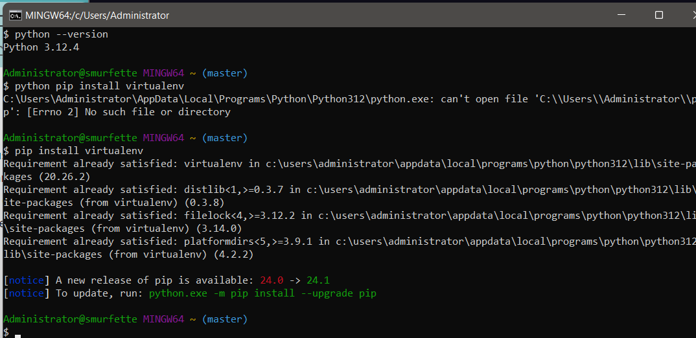
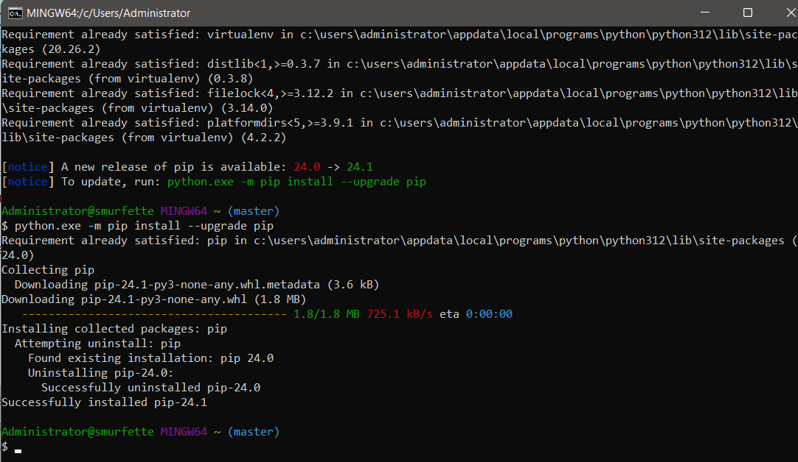
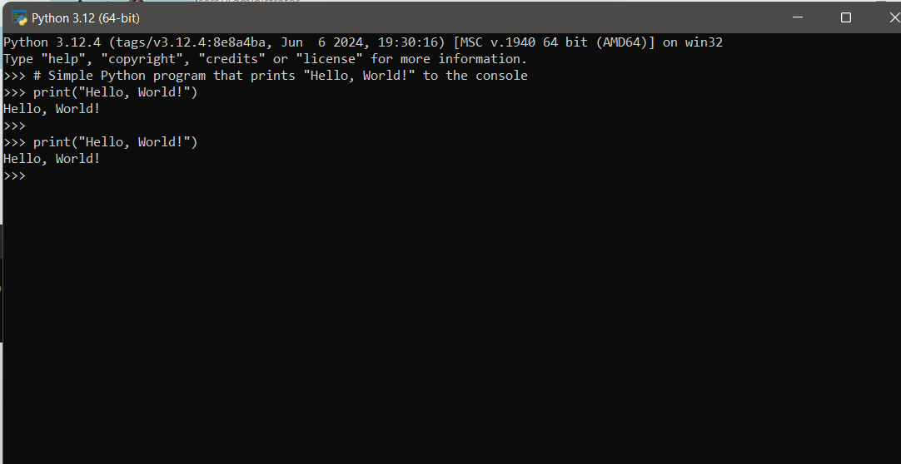
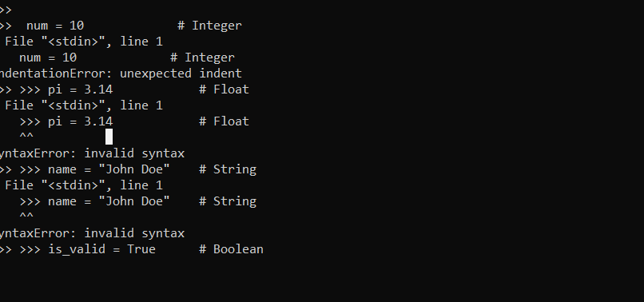
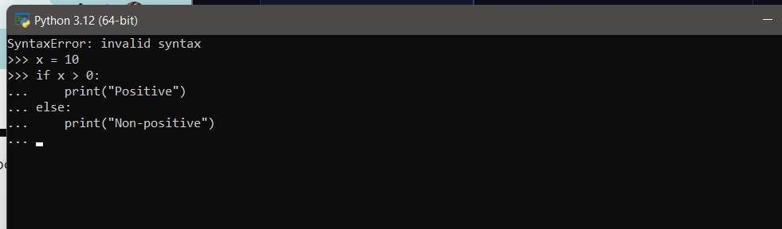

# SE-Assignment-6
 Assignment: Introduction to Python
Instructions:
Answer the following questions based on your understanding of Python programming. Provide detailed explanations and examples where appropriate.

 Questions:

1. Python Basics:
   - What is Python, and what are some of its key features that make it popular among developers? Provide examples of use cases where Python is particularly effective.

Python Basics:

Python is a high-level, interpreted programming language known for its simplicity and readability. Some key features that make Python popular among developers include its easy syntax, extensive standard library, support for multiple programming paradigms (such as procedural, object-oriented, and functional programming), and strong community support.
Use cases where Python is particularly effective include web development (using frameworks like Django and Flask), data analysis and visualization (with libraries like Pandas, NumPy, and Matplotlib), artificial intelligence and machine learning (using libraries such as TensorFlow and PyTorch), automation and scripting, and scientific computing.

2. Installing Python:
   - Describe the steps to install Python on your operating system (Windows, macOS, or Linux). Include how to verify the installation and set up a virtual environment.

Windows: Download the Python installer from the official Python website, run the installer, and follow the prompts. Make sure to check the option to add Python to PATH during installation. To verify the installation, open a command prompt and type python --version. To set up a virtual environment, install the virtualenv package using pip and create a virtual environment using virtualenv env_name.

3. Python Syntax and Semantics:
   - Write a simple Python program that prints "Hello, World!" to the console. Explain the basic syntax elements used in the program.

Basic syntax elements:
print() function: Used to print output to the console.
"Hello, World!": String literal enclosed in double quotes.

4. Data Types and Variables:
   - List and describe the basic data types in Python. Write a short script that demonstrates how to create and use variables of different data types.

5. Control Structures:
   - Explain the use of conditional statements and loops in Python. Provide examples of an `if-else` statement and a `for` loop.

6. Functions in Python:
   - What are functions in Python, and why are they useful? Write a Python function that takes two arguments and returns their sum. Include an example of how to call this function.

  Functions in Python are reusable blocks of code that perform a specific task.

  # Function to add two numbers
def add_numbers(a, b):
    return a + b

# Calling the function
result = add_numbers(5, 3)
print(result)  # Output: 8

7. Lists and Dictionaries:
   - Describe the differences between lists and dictionaries in Python. Write a script that creates a list of numbers and a dictionary with some key-value pairs, then demonstrates basic operations on both.

Lists: Ordered collection of items. Example: numbers = [1, 2, 3, 4, 5]
Dictionaries: Key-value pairs. Example: person = {'name': 'John', 'age': 30, 'city': 'New York'}

numbers = [1, 2, 3, 4, 5]
person = {'name': 'John', 'age': 30, 'city': 'New York'}

# Basic operations on lists and dictionaries
print(numbers[0])        # Accessing list item
print(person['name'])    # Accessing dictionary value
numbers.append(6)        # Adding to list
person['gender'] = 'Male'  # Adding to dictionary

8. Exception Handling:
   - What is exception handling in Python? Provide an example of how to use `try`, `except`, and `finally` blocks to handle errors in a Python script.

 Exception handling in Python is used to handle errors and exceptions gracefully.

 try:
    result = 10 / 0
except ZeroDivisionError:
    print("Error: Division by zero")
finally:
    print("This block is always executed")

9. Modules and Packages:
   - Explain the concepts of modules and packages in Python. How can you import and use a module in your script? Provide an example using the `math` module.

 Modules: Python files containing definitions and statements. Example: import math
Packages: Collection of modules. Example: import numpy as np

import math

# Using the math module to calculate square root
result = math.sqrt(25)
print(result)  # Output: 5.0

10. File I/O:
    - How do you read from and write to files in Python? Write a script that reads the content of a file and prints it to the console, and another script that writes a list of strings to a file.

with open('example.txt', 'r') as file:
    content = file.read()
    print(content)

Writing to a file:
data = ['Line 1', 'Line 2', 'Line 3']
with open('output.txt', 'w') as file:
    for line in data:
        file.write(line + '\n')

# Submission Guidelines:
- Your answers should be well-structured, concise, and to the point.
- Provide code snippets or complete scripts where applicable.
- Cite any references or sources you use in your answers.
- Submit your completed assignment by [due date].

